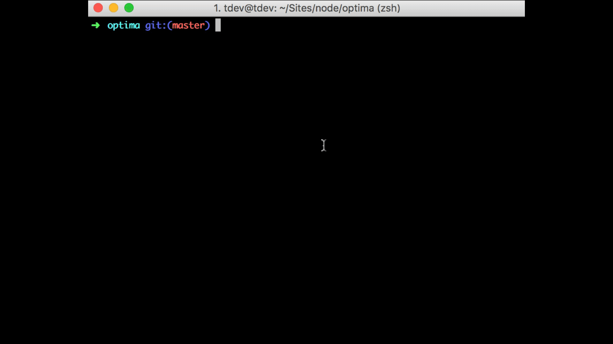

# Image optimizer for s3

This app will get all objects(1000) that are .jpg or .png resize them and put them back.

Why? Because large images take a long time to download. By resizing them, you can reduce page load time for pages where the bucket images are served to.

1. fill out ```example.config.js``` and rename to ```config.js```.
 
2. Install dependencies

 ```
 npm install
 ```
3. Run start script

 ```
 npm start 
 ```

# Screenshots


